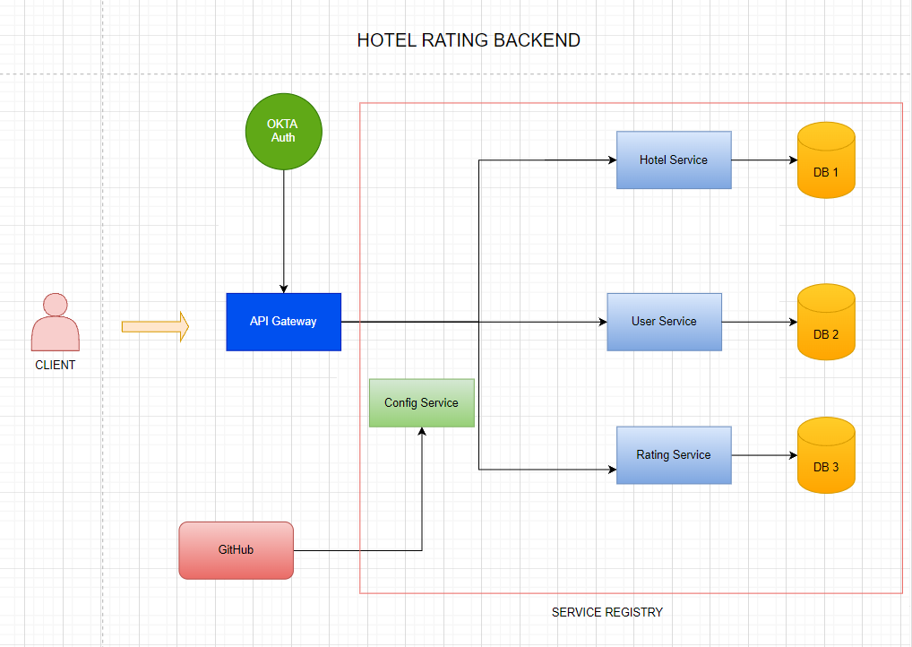

## Before Microservice

- Monolithic Architecture: multiple components are combined in single large app
- Single Code base
- Deployed as a single bundle
- Change in one service, then whole app in redeployed
- Building Problem: developers have to communicate the changes for seamless integration
- Problem in scale
- Cumbersome over time

*****

## Microservices

### Advantages

- Large apps are divided into small parts
- Commnuicate using APIs (REST, gRPC etc.) or Brokers
- Different codebases (multiple languages: python, js, java etc.)
- Each module managed independently
- Different tech stacks

### Disadvantages

- Handling microservice is complex
- For smaller team, it is not recommended
- If the user base is increasing then switching to Microservices is recommended

*** 
## Architecture
